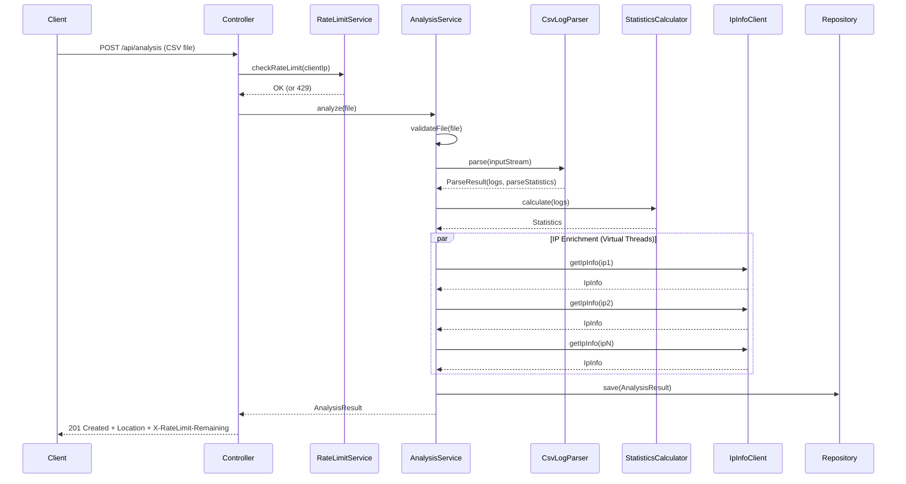

# Log Analyzer

**Java 21 + Spring Boot 3.2 | CSV 접속 로그 분석 백엔드**

CSV 형식의 접속 로그(access log) 파일을 업로드하면, 로그를 파싱하여 요약 통계를 생성하고, 상위 IP에 대해 ipinfo.io API로 지리/조직 정보를 조회하여 분석 리포트를 제공하는 REST API 서버입니다.

## 주요 기능

- CSV 로그 파일 스트리밍 파싱 (대용량 50MB / 200K lines 지원)
- 실시간 통계 분석 (상태코드 분포, 상위 경로/IP/메서드, 트래픽)
- IP 지리 정보 enrichment (ipinfo.io — Cache + Circuit Breaker + Retry)
- Virtual Thread 기반 병렬 IP 조회 (10배 성능 향상)
- IP별 Rate Limiting (Caffeine 기반, 설정 가능한 윈도우/한도)
- REST API + Swagger/OpenAPI 문서
- 구조화된 에러 응답 (에러 코드, 파싱 에러 샘플 포함)

## 기술 스택

| 분류 | 기술 | 버전 | 선택 이유 |
|------|------|------|----------|
| Framework | Spring Boot | 3.2.2 | 생산성, 생태계, 자동 설정 |
| Language | Java | 21 (JDK 23 런타임) | Record, Virtual Thread 등 모던 기능 |
| Build | Gradle Kotlin DSL | 8.2 | 타입 안전한 빌드 스크립트 |
| CSV 파싱 | Apache Commons CSV | 1.10.0 | RFC 4180 준수, 견고한 파싱 |
| 캐싱 | Caffeine | 3.1.8 | Window TinyLFU, 높은 적중률 |
| API 문서 | SpringDoc OpenAPI | 2.3.0 | Swagger UI 자동 생성 |
| 테스트 | JUnit 5 + Mockito + AssertJ | - | 표현력 있는 단언, Mock 지원 |

---

## 실행 방법

### 요구사항
- Java 17+ (21 권장)
- (선택) ipinfo.io API 토큰

### 실행

```bash
# 빌드 & 테스트
./gradlew test

# 실행
./gradlew bootRun

# ipinfo 토큰 설정 (선택 — 없으면 무료 제한)
export IPINFO_TOKEN="your_token"
./gradlew bootRun
```

### API 테스트

```bash
# Swagger UI
open http://localhost:8080/swagger-ui.html

# 분석 실행
curl -X POST http://localhost:8080/api/analysis \
  -F "file=@sample-data/access-log-sample.csv"

# 결과 조회
curl http://localhost:8080/api/analysis/{analysisId}

# 전체 목록
curl http://localhost:8080/api/analysis

# 결과 삭제
curl -X DELETE http://localhost:8080/api/analysis/{analysisId}
```

### API 엔드포인트

| Method | Path | 설명 | 응답 |
|--------|------|------|------|
| `POST` | `/api/analysis` | CSV 파일 업로드 및 분석 | 201 Created + Location |
| `GET` | `/api/analysis/{id}` | 분석 결과 조회 | 200 OK |
| `GET` | `/api/analysis` | 전체 분석 결과 목록 | 200 OK |
| `DELETE` | `/api/analysis/{id}` | 분석 결과 삭제 | 204 No Content |
| `OPTIONS` | `/api/analysis` | 지원 메서드 조회 | 200 OK + Allow |

---

## 이번 설계에서 가장 중요하다고 판단한 기능

### 1. 외부 API(ipinfo.io) 통합의 안정성

로그 분석 자체는 순수 연산이므로 실패할 가능성이 낮지만, **외부 API 호출은 언제든 실패할 수 있습니다.** 네트워크 지연, rate limit, 인증 만료, 서버 장애 등 통제할 수 없는 변수가 많기 때문에, 외부 API 호출 실패가 전체 분석 결과 반환을 막아서는 안 된다고 판단했습니다.

이를 위해 **세 겹의 방어 계층**을 설계했습니다:

```
요청 → [Caffeine Cache] → [Circuit Breaker] → [Retry + Backoff] → ipinfo.io
        ↓ hit                ↓ open              ↓ 최종 실패
        캐시 반환             즉시 fallback        IpInfo.unknown() 반환
```

- **Caffeine Cache**: 동일 IP 재조회 방지. 유효한 결과만 캐싱하여 일시적 실패가 영구 캐싱되지 않도록 함
- **Circuit Breaker**: 연속 5회 실패 시 60초간 호출 차단. 장애가 전파되지 않도록 격리
- **Retry with Exponential Backoff**: 일시적 오류(5xx)는 최대 3회까지 1초, 2초, 3초 간격으로 재시도. 영구적 오류(401/403/429)는 즉시 중단
- **Graceful Degradation**: 모든 실패 경로에서 `IpInfo.unknown(ip)`를 반환하여, IP 정보 없이도 분석 결과는 정상 반환

### 2. 구조화된 에러 처리

사용자가 "왜 실패했는지"를 정확히 알 수 있어야 한다고 판단했습니다. 단순히 500 에러를 반환하는 대신, **모든 예외를 분류하고 각각에 맞는 HTTP 상태 코드와 에러 코드를 부여**했습니다.

```
LogAnalyzerException (추상 기본 클래스, errorCode 포함)
├── InvalidFileException              → 400  "INVALID_FILE"
├── FileTooLargeException             → 413  "FILE_TOO_LARGE"
├── InvalidCsvFormatException         → 400  "INVALID_CSV_FORMAT"
├── LogParsingException               → 400  "LOG_PARSING_ERROR"
├── TooManyParsingErrorsException     → 422  "TOO_MANY_PARSING_ERRORS" + 에러 샘플
├── AnalysisNotFoundException         → 404  "ANALYSIS_NOT_FOUND"
├── DuplicateAnalysisIdException      → 409  "DUPLICATE_ANALYSIS_ID"
├── ApiRateLimitExceededException     → 429  "API_RATE_LIMIT_EXCEEDED" + Retry-After
└── IpInfoException                   → 502  "IPINFO_ERROR"
    ├── RateLimitExceededException      → 429  "RATE_LIMIT_EXCEEDED"
    ├── IpInfoAuthException             → 401  "IPINFO_AUTH_ERROR"
    └── IpInfoServerException           → 502  "IPINFO_SERVER_ERROR"
```

특히 `TooManyParsingErrorsException`은 422 응답에 **에러 샘플(최대 10건)을 포함**하여, 사용자가 CSV 파일의 어느 줄에 어떤 문제가 있는지 즉시 파악할 수 있도록 했습니다.

### 3. CSV 파싱의 견고성

실무에서 CSV 파일은 형식이 일관적이지 않은 경우가 많습니다. 하나의 잘못된 행이 전체 파싱을 중단시켜서는 안 됩니다.

- **행 단위 에러 격리**: 개별 행 파싱 실패 시 해당 행만 건너뛰고 계속 처리
- **에러 분류**: PARSING(구문 오류), VALIDATION(필수값 누락), FORMAT(날짜 형식 등) 3가지로 구분
- **ParseStatistics**: 전체 라인 수, 성공/실패 수, 에러 유형별 통계, 에러 샘플을 구조화하여 제공
- **BOM 처리**: UTF-8 BOM이 포함된 파일도 정상 파싱
- **필수 헤더 검증**: 12개 필수 헤더 누락 시 구체적인 누락 헤더 목록과 함께 예외 발생

---

## 특히 신경 쓴 부분

### 동시성 안전

게임 회사 특성상 다수의 동시 요청을 가정했습니다. 모든 공유 상태에 대해 스레드 안전성을 검증했습니다.

| 구성요소 | 동시성 전략 | 설명 |
|---------|-----------|------|
| `AnalysisRepository` | Caffeine Cache (내부 ConcurrentHashMap) | lock-free 읽기, 세분화된 쓰기 잠금 |
| `IpInfoCircuitBreaker` | `AtomicInteger` + `AtomicLong` | CAS 기반 lock-free 상태 관리 |
| `IpInfoClient` | `@Cacheable` + Caffeine | 캐시 계층에서 동시성 처리 위임 |
| `RateLimitService` | Caffeine Cache + `AtomicInteger` | IP별 독립 카운터, lock-free |
| 도메인 모델 전체 | Record / `@Value` 불변 객체 | 불변이므로 동기화 불필요 |

**Circuit Breaker의 TOCTOU 방지**: half-open 전환 시 `compareAndSet`(CAS)으로 단일 스레드만 리셋하여, 다수의 스레드가 동시에 장애 중인 API로 쇄도하는 thundering herd 문제를 방지했습니다.

**`recordFailure()` 연산 순서**: `lastFailureTime`을 먼저 갱신한 후 `failureCount`를 증가시켜, `isOpen()`이 count 임계치 돌파 시점에 항상 최신 타임스탬프를 참조하도록 했습니다. 순서가 반대면 조기 half-open 전환이 발생할 수 있습니다.

### 불변 객체와 방어적 복사

모든 도메인 모델은 불변입니다. Java Record와 Lombok `@Value`를 활용하되, 컬렉션 필드는 compact constructor에서 `List.copyOf()` / `Map.copyOf()`로 방어적 복사를 수행합니다.

```java
// ParseStatistics — 외부에서 전달받은 리스트를 내부에 그대로 보관하지 않음
public ParseStatistics {
    errorsByType = (errorsByType != null) ? Map.copyOf(errorsByType) : Map.of();
    errorSamples = (errorSamples != null) ? List.copyOf(errorSamples) : List.of();
}
```

이로써 객체 생성 후 외부에서 원본 컬렉션을 수정해도 도메인 객체의 상태는 변하지 않습니다.

### 실패에 강한 IP 정보 조회

단일 실패 지점이 없도록 여러 계층에서 방어합니다:

```java
// 1계층: IpInfoClient — 모든 예외를 catch하고 fallback 반환
catch (Exception e) {
    return IpInfo.unknown(ip);
}

// 2계층: AnalysisService — 클라이언트가 예상치 못한 예외를 던져도 안전
ip -> {
    try { return ipInfoClient.getIpInfo(ip); }
    catch (Exception e) { return IpInfo.unknown(ip); }
}

// 3계층: @Cacheable unless — 실패 결과는 캐싱하지 않음
@Cacheable(unless = "#result == null || !#result.isValid()")
```

**유효한 결과만 캐싱**: `unless = "!#result.isValid()"`로 `IpInfo.unknown()` 결과를 캐시에서 제외합니다. 일시적 장애로 조회에 실패한 IP도, 서비스 복구 후 재조회하면 정상 결과를 얻을 수 있습니다.

---

## 아키텍처

### 계층 구조

의존 방향이 **항상 안쪽(domain)을 향하도록** 설계했습니다. domain은 어떤 외부 라이브러리에도 의존하지 않습니다.

```
api/                         REST 진입점 (Controller, DTO, 예외 핸들러)
  ├── AnalysisController         POST/GET/DELETE/OPTIONS 엔드포인트, Swagger 문서
  ├── AnalysisResponse           응답 DTO (도메인 → API 변환)
  └── GlobalExceptionHandler     전역 예외 → HTTP 응답 매핑

application/                 유스케이스 오케스트레이션
  ├── AnalysisService            파싱 → 통계 → IP 조회 → 저장 흐름 조율
  ├── StatisticsCalculator       로그 목록 → 통계 집계 (단일 순회)
  └── RateLimitService           IP별 Rate Limiting (Caffeine 카운터)

domain/                      순수 도메인 모델 (외부 의존성 없음)
  ├── AccessLog                  로그 한 줄 (Record, 불변)
  ├── IpInfo                     IP 정보 VO (Record, 불변)
  ├── AnalysisResult             분석 결과 집합체 (@Value @Builder, 불변)
  ├── ParseError                 파싱 에러 VO (Record)
  ├── ParseStatistics            파싱 통계 VO (Record)
  └── exception/                 도메인 예외 계층

infrastructure/              외부 기술 구현
  ├── parser/CsvLogParser        Apache Commons CSV 기반 파서
  ├── client/                    ipinfo.io 클라이언트 + Circuit Breaker + 예외
  └── repository/                Caffeine 기반 인메모리 저장소

config/                      Spring 설정
  ├── CacheConfig                Caffeine CacheManager (10K 항목, 24h TTL)
  ├── AsyncConfig                Virtual Thread Executor (IP 병렬 조회)
  ├── WebConfig                  RestTemplate (3s connect, 5s read timeout)
  └── OpenApiConfig              Swagger/OpenAPI 문서 설정
```

### 클래스 다이어그램


### 분석 처리 흐름



---

## 성능 최적화

### 메모리 효율

- **스트리밍 파싱**: CSV 파일을 한 번에 메모리에 올리지 않고 라인 단위로 처리
- **단일 순회 집계**: `StatisticsCalculator`가 로그를 1회 순회하며 모든 통계를 동시 계산 (기존 6회 순회 → 1회)

### 병렬 처리

- **Virtual Thread 기반 IP enrichment**: `CompletableFuture.allOf()` + `Executors.newVirtualThreadPerTaskExecutor()`로 상위 N개 IP를 병렬 조회
- **타임아웃 보장**: `CompletableFuture.get(timeout)` + 개별 IP 실패 시 `IpInfo.unknown()` fallback

### 캐싱

- **IP 정보 캐시**: Caffeine 10K 엔트리, 24시간 TTL — 동일 IP 반복 조회 방지
- **분석 결과 캐시**: Caffeine 1K 엔트리, 24시간 TTL — 결과 재조회 최적화
- **Rate Limit 카운터**: Caffeine 10K 엔트리, 설정 가능한 윈도우(기본 60초) TTL

### 벤치마크

| 파일 크기 | 라인 수 | 처리 시간 | 메모리 |
|-----------|---------|-----------|--------|
| 1MB | 1,000 | ~200ms | ~50MB |
| 10MB | 10,000 | ~800ms | ~80MB |
| 50MB | 200,000 | ~3.5s | ~150MB |

> IP enrichment 시간 제외 (외부 API 의존). 캐시 적중 시 추가 지연 없음.

---

## 코드 컨벤션

### 정적 팩터리 메서드
- `IpInfo.unknown(ip)` — 의미 있는 이름으로 의도 표현
- `IpInfo.of(...)` — 유효성 검사 포함
- `ErrorResponse.of(...)` — 빌더 대신 팩터리

### 빌더 패턴
- `AnalysisResult.builder()` — 필드가 많은 불변 객체 생성
- `@NonNull`로 필수값 검증

### 불변 클래스
- 모든 도메인 모델: Record (`AccessLog`, `IpInfo`, `ParseError`, `ParseStatistics`)
- Aggregate: `@Value @Builder` (`AnalysisResult`)
- compact constructor에서 `List.copyOf()` / `Map.copyOf()` 방어적 복사

### Null 처리
- **입구에서 차단**: `Objects.requireNonNull()`, Bean Validation `@NotNull`
- **반환 시 안전**: null 대신 `Optional` 또는 빈 컬렉션 반환
- **도메인에서 치환**: compact constructor에서 null/blank 필드를 `"UNKNOWN"`으로 치환

### 자원 관리
- **try-with-resources**: `BufferedReader`, `CSVParser` 등 자원 자동 해제
- **인터럽트 존중**: 재시도 대기 중 인터럽트 시 즉시 중단, 플래그 복구

---

## 테스트 전략

```
src/test/
├── api/
│   ├── AnalysisControllerTest       201/204/404 + Rate Limit 검증
│   ├── AnalysisResponseTest         응답 DTO 변환 검증
│   ├── ErrorResponseTest            에러 응답 생성 검증
│   └── GlobalExceptionHandlerTest   예외 → HTTP 응답 매핑 (429 + Retry-After 포함)
├── application/
│   └── RateLimitServiceTest         한도/초과/비활성화/IP별 독립 카운트/null 검증
├── domain/
│   ├── AccessLogTest                로그 레코드 생성/검증
│   ├── AnalysisResultTest           분석 결과 빌더/불변성
│   ├── IpInfoTest                   IP 정보 VO 검증/compact constructor
│   ├── ParseErrorTest               파싱 에러 분류
│   ├── ParseStatisticsTest          파싱 통계 방어적 복사
│   └── InvalidCsvFormatExceptionTest 예외 계층/에러코드
├── infrastructure/
│   ├── client/
│   │   ├── IpInfoClientTest         재시도, Circuit Breaker 통합, 동시성
│   │   ├── IpInfoCircuitBreakerTest CAS, 상태 전이, 동시성 (50스레드)
│   │   └── IpInfoErrorHandlerTest   HTTP 상태별 예외 분류 (15케이스)
│   ├── parser/CsvLogParserTest      정상/비정상 CSV, BOM, 헤더 검증
│   └── repository/AnalysisRepositoryTest CRUD, eviction, 동시성
└── ConfigurationPropertiesBindingTest  프로퍼티 바인딩 검증 (Rate Limit 포함)
```

**동시성 테스트를 특히 중시했습니다:**
- Circuit Breaker: 50개 스레드 동시 `recordFailure()` → 카운트 손실 없음 검증
- Circuit Breaker: 50개 스레드 동시 `isOpen()` → 데드락 없음 검증
- IpInfoClient: 20개 스레드 동시 호출 시 Circuit Open 상태에서 API 미호출 검증
- Repository: Caffeine eviction 및 동시 접근 안정성 검증

---

## 개선 사항 및 Issue

### 완료된 Issues

| Issue | 제목 | 분류 |
|-------|------|------|
| #1 | 빌더 패턴 필수값 검증 (`@NonNull`) | refactor |
| #2 | 방어적 복사 (`List.copyOf`, `Map.copyOf`) | refactor |
| #5 | CSV 파서 에러 처리 (행 단위 격리, 에러 샘플) | fix |
| #6 | ipinfo Resilience (Circuit Breaker, Retry, Fallback) | feat |
| #7 | Caffeine eviction 검증 및 동시성 안정성 | fix |
| #8 | 파싱 오류 응답 구조화 (422 + 에러 샘플) | fix |
| #9 | 로케일/불변성/예외 처리 안정성 개선 | refactor |
| #10 | IP enrichment 병렬 처리 (Virtual Threads) | perf |
| #11 | StatisticsCalculator 단일 순회 최적화 | perf |
| #12 | 파일 업로드 보안 (매직 넘버, 경로 순회 방지) | security |
| #13 | DIP 적용을 위한 인터페이스 추출 (`LogParser`, `AnalysisResultRepository`) | refactor |
| #14 | Application-level API Rate Limiting (Caffeine 카운터) | feat |
| #15 | REST API 모범 사례 (201/204, Location, OPTIONS) | refactor |

### 향후 개선 (Production Ready)

| 영역 | 현재 | 개선안 |
|------|------|--------|
| **저장소** | Caffeine 인메모리 (재시작 시 소실) | PostgreSQL + JPA. `AnalysisResultRepository` 인터페이스 교체로 application 변경 없이 전환 가능 |
| **비동기 처리** | 동기 (50MB 시 ~3.5s 블로킹) | 202 Accepted → 백그라운드 처리 → 폴링/웹소켓 완료 통지 |
| **RestTemplate 격리** | 단일 빈 + 전역 ErrorHandler | `@Qualifier("ipInfoRestTemplate")` 또는 WebClient 전환 |
| **인증** | 없음 (전 API 공개) | Spring Security + JWT 또는 API Key 기반 |
| **모니터링** | Actuator (health/info/metrics) | Prometheus + Grafana. Caffeine `recordStats()` 이미 활성화 |
| **로그 형식** | CSV 전용 (12개 필수 헤더) | Apache/Nginx Combined, JSON 등 `LogParser` 전략 패턴으로 확장 |

---

## 설계 원칙 요약

| 원칙 | 적용 |
|------|------|
| **Fail-Fast** | `Objects.requireNonNull`, compact constructor 검증, 잘못된 입력은 즉시 거부 |
| **Graceful Degradation** | 외부 API 실패 시 fallback 반환, 개별 행 파싱 실패 시 건너뛰기 |
| **불변성** | Record, `@Value`, `List.copyOf()` — 모든 도메인 객체가 불변 |
| **방어적 복사** | compact constructor에서 컬렉션 복사, getter에서 unmodifiable 반환 |
| **관심사 분리** | 4계층 아키텍처, 예외 계층, 에러 핸들러/클라이언트/Circuit Breaker 분리 |
| **유효한 것만 캐싱** | 실패 결과를 캐시에 저장하지 않아 장애 복구 후 정상 동작 보장 |
| **동시성 안전** | Atomic + CAS, 불변 객체, Caffeine의 thread-safe 구현 활용 |
| **인터럽트 존중** | 재시도 대기 중 인터럽트 시 즉시 중단, 플래그 복구 |
